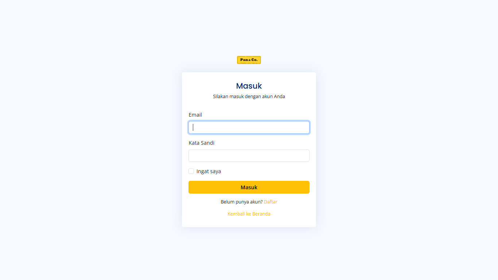
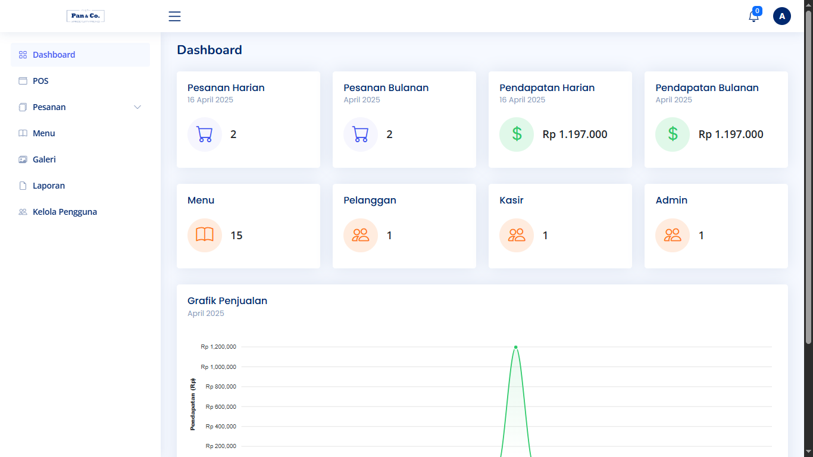

# Restaurant Order System - PHP Native

Selamat datang di proyek **Restaurant Order System - PHP Native**! 🎉 Ini adalah aplikasi yang dibangun menggunakan PHP Native dengan studi kasus **Sistem Pelayanan Restoran**.

## 🖥️ Tampilan Aplikasi

### 1. **Landing Page:**


### 2. **Login:**


### 3. **Dashboard:**


## 📦 Cara Instalasi

1. **Clone Repository**:
    ```bash
    git clone https://github.com/alfian742/restaurant-order-system.git
    ```

2. **Masuk ke Direktori Proyek**:
    ```bash
    cd restaurant-order-system
    ```

3. **Konfigurasi Database**:
    - Buat database baru di MySQL.
    - Impor file `restaurant_order_system.sql` yang ada di folder `config/database` ke database baru tersebut.

4. **Sesuaikan Konfigurasi**:
    - Edit file `config.php` untuk menambahkan detail koneksi database Anda.

5. **Jalankan Aplikasi**:
    - Pastikan server web lokal seperti Apache atau Nginx aktif. Contoh perangkat lunak yang dapat digunakan adalah Laragon, XAMPP, atau MAMP.
    - Akses aplikasi melalui browser dengan membuka `http://localhost/restaurant-order-system`.

## 📖 Panduan Penggunaan

1. **Login ke Aplikasi**:
    - Gunakan kredensial berikut untuk login ke aplikasi:
      - **Admin**:
        - **Email**: `admin@gmail.com`
        - **Password**: `admin`
    
      - **User**:
        - **Email**: `user@gmail.com`
        - **Password**: `user1234`

2. **Jelajahi Menu**:
    - Setelah login, Anda akan dapat mengakses berbagai menu untuk mengelola data sesuai dengan peran Anda (Admin atau User).
3. **Demo Aplikasi:**
   - Silakan akses demo aplikasi yang telah dideploy melalui tautan berikut: [Restaurant Order System](http://my-public-project.infinityfreeapp.com/restaurant-order-system/).

---

Terima kasih telah mengunjungi repositori ini! Jika Anda memiliki pertanyaan atau saran, jangan ragu untuk menghubungi saya.
